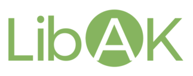

The Salesforce LibAK contains the next modules:

1. DatabaseUtils
    - [Code](DatabaseUtils)
    - [Documentation](DatabaseUtils/DatabaseUtils.md)
2. DynamicSOQL (depends on the ***DatabaseUtils*** module.)
    - [Code](DynamicSOQL)
    - [Documentation Apex API](DynamicSOQL/DynamicSOQL.md)
    - [Documentation JavaScript API](DynamicSOQL/DynamicSOQL_JS_API.md)
    - [LinkedIn Article](https://www.linkedin.com/pulse/dynamicsoql-flexible-object-oriented-solution-andrew-kohanovskij/?trackingId=X14jMLUut%2FAeib0kLTLBaw%3D%3D)
3. LWCFramework
    - [Code](LWCFramework)
4. SobjectLookup
    - [Code](SobjectLookup)
5. SobjectTable
    - [Code](SobjectTable)
6. RestFramework
    - [Code](RestFramework)
    - [Documentation](RestFramework/RestFramework.md)
    - [LinkedIn Article](https://www.linkedin.com/pulse/mastering-rest-framework-building-robust-restful-web-apex-andrei-wefqe/?trackingId=jcjCrkHqxL3%2FnBgSs8uBXQ%3D%3D)